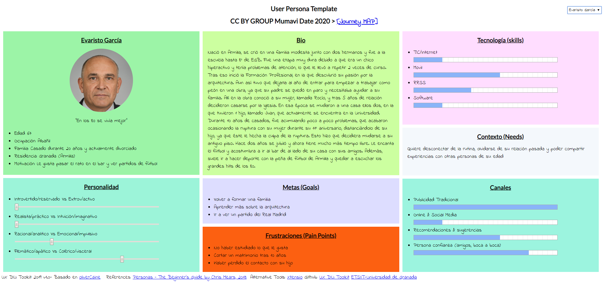
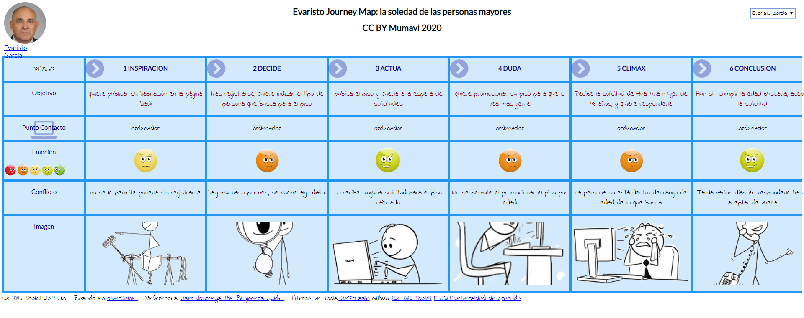

## DIU - Practica1, entregables

- Desk research: Análisis Competencia 
- 2 Personas 
- 2 User Journey Map  ( 1 por persona)
- Revisión de Usabilidad 

## COMPETITIVE ANALYSIS

Las aplicaciones de compartir piso se caracterizan por tener una herramienta de búsqueda que utilizas para establecer la zona en la que buscas tu piso. La principal diferencia entre las aplicaciones es si permiten utilizar esta funcionalidad sin necesidad de registrarse, como por ejemplo Badi, y las que no, como es el caso de Coachsurfing Travel o Splitwise.

Otra importante diferencia es la forma en que se muestran los pisos disponibles, y la información que se proporciona del anunciante (cúanto se respeta su privacidad). Esto nos llevó a descartar PisoCompartido puesto que mostraba el número de teléfono (e incluso si estaba conectado a la aplicación o no, en tiempo real) del anunciante a cualquier persona, registrada o no, que visitara el anuncio.

Debido tanto a estos dos criterios como a en general un proceso de registro mucho más amigable que el de la competencia y un listado de los pisos resultado de la búsqueda intuitivo y agradable, decidimos enfocar nuestro trabajo en Badi.

| Aplicación | Autentificación no requerida | Privacidad | Buscar piso | Organizar gastos | Ayuda por chat online | Personalización avanzada del perfil |
| --- | ----------- | ----------- | ----------- | ----------- | ----------- | ----------- |
| Badi | ✔ | ✔ | ✔ | ✘ | ✔ | ✔ |
| Coachsurfing Travel | ✘ | ✔ | ✔ | ✘ | ✘ | ✔ |
| Splitwise | ✘ | ✔ | ✘ | ✔ | ✘ | ✘ |
| PisoCompartido | ✔ | ✘ | ✔ | ✘ | ✘ | ✘ |

## PERSONAS
- **Erika:** en el registro se debía elegir entre género chico/chica, lo que puede ocasionar problemas de convivencia para personas como Erika. Además, solucionar el problema que esta Persona encuentra es sencillo, barato y tiene un gran impacto.

- **Evaristo:** es común entre personas mayores buscar compañía con la que vivir; además, habitualmente, las personas de edad avanzada tienen problemas al usar aplicaciones con interfaces de usuario mejorables.

## USER JOURNEY MAPS
- **Erika:** nuestra inspiración para crear a Erika fue imaginar la situación que podría ocurrir cuando alguien con este perfil utiliza la aplicación, y eso es lo representado en el journey map. A más personas no se identifiquen con los dos géneros clásicos, más habitual se volvería.

- **Evaristo:** para crear el journey map de Evaristo nos fijamos en que el tutorial disponible en la página es muy pobre, algo que puede provocar que usuarios poco experimentados como él pierdan tiempo y ganas de utilizarla. Es una situación muy común hoy en día.

## USABILITY REVIEW
- **Puntuación:** 85.
