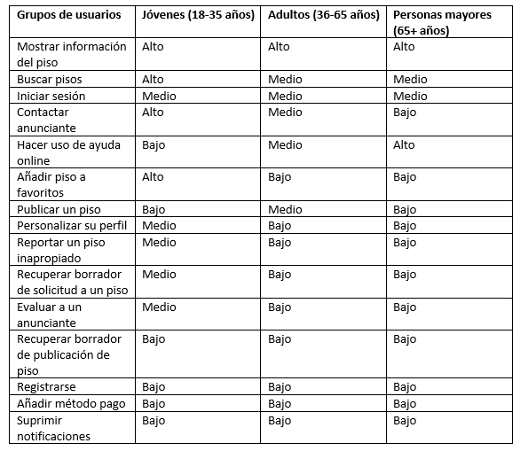

## Paso 2. UX Design  

 2.a Feedback Capture Grid
----

Con FHome queremos implementar nuevas ideas basadas en el estudio que se ha realizado en este documento que incluyen búsqueda inteligente de pisos, uso de heurísticas para mejorar la experiencia de usuario y mejoras generales en la calidad de la experiencia de cada cliente.

 2.b Tasks & Sitemap 
-----
- TASKS:

Se han implementado todas las tareas en los Wireframes de la sección 2.d de este documento.

- SITEMAP:

** Leyenda **
Las flechas direccionales implican navegación entre los elementos conectados en la dirección que marca la punta.
Las flechas discontinuas implican compartición automática de información: por ejemplo, la información del perfil del anunciante de un piso está disponible al visitar el piso que ha visitado

 2.c Labelling

Término | Significado     
| ------------- | -------
index  | pagina principal de la aplicación
user_profile | perfil de cada usuario
edit_user_profile | página para la personalización del perfil de usuario
publish_flat | página para publicar tu piso
search_flat | resultados de busqueda de piso
flat_details | detalles de un piso concreto
payment | pantalla de pagos
help | seccion de ayuda
about_us | pagina de información sobre la empresa
contact_us | seccion con información de contacto

 2.d Wireframes
-----

>>> Plantear el  diseño del layout para Web/movil (organización y simulación ) 
