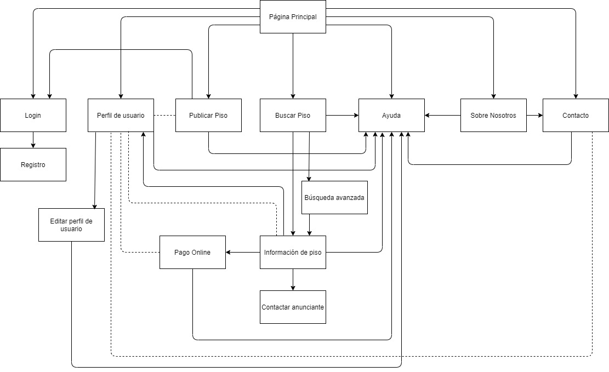

## Paso 2. UX Design  

 2.a Feedback Capture Grid
----

Con FHome queremos implementar nuevas ideas basadas en el estudio que se ha realizado en este documento que incluyen búsqueda inteligente de pisos, uso de heurísticas para mejorar la experiencia de usuario y mejoras generales en la calidad de la experiencia de cada cliente.

 2.b Tasks & Sitemap 
-----
- TASKS:

Se han implementado todas las tareas en los Wireframes de la sección 2.d de este documento.

- SITEMAP:

** Leyenda **
Las flechas direccionales implican navegación entre los elementos conectados en la dirección que marca la punta.
Las flechas discontinuas implican compartición automática de información: por ejemplo, la información del perfil del anunciante de un piso está disponible al visitar el piso que ha visitado

 2.c Labelling

Término | Significado     
| ------------- | -------
Página Principal  | pagina principal de la aplicación: enlaza principalmente a buscar piso y publicar piso, aunque muestra también recomendaciones.
Perfil de usuario | perfil de cada usuario; en caso de acceder al propio sin haber iniciado sesión, da la opción de hacerlo; si se ha iniciado sesión da la opción de editar perfil y la opción de configurar el método de pago
Editar perfil de usuario | página que contiene tanto la personalización del perfil personal como la opción de permitir el envío de sugerencias por email y notificaciones a través de la aplicación
Publicar Piso | formulario formado por cuatro etapas a rellenar para publicar un nuevo piso, que se puede localizar por dirección absoluta o utilizando un mapa. Es necesario iniciar sesión para utilizar esta funcionalidad, por lo que se ofrece opción de login si no lo estuviera.
Buscar Piso | página para buscar piso, que se puede realizar utilizando un mapa o introducciendo una dirección. Cualquier alternativa actualiza la otra.
Búsqueda avanzada | al buscar piso se puede optar por esta búsqueda avanzada mediante la aplicación de filtros
Información de piso | detalles de un piso concreto, que incluye información avanzada para facilitar la convivencia, ubicación del piso mostrada como dirección absoluta y en un mapa con información adicional de los establecimientos cercanos así como un resumen del perfil del anunciante
Pago online | pantalla de pagos que se rellena con la información que se haya rellenado en la sección de pagos del perfil propio. Si no se ha rellenado o no se ha iniciado sesión, se ofrece la opción que corresponda.
Ayuda | sección de ayuda, a la que se puede acceder como pop-up desde cualquier otra sección de la app y contiene dos opciones: visualizar videotutoriales breves o contactar con el soporte técnico a través de un chat online que estima el tiempo de espera hasta recibir respuesta en base a una heurística
Sobre nosotros | pagina de información sobre la empresa, con enlace a la página de contacto así como información legal
Contacto | sección con información de contacto con los diferentes equipos de atención a entidades externas de la empresa
Login | pantalla de inicio de sesión: se puede cerrar para continuar la navegación como invitado a menos que se quiera publicar un piso, acceder a una cuenta existente indicando nombre de usuario/email y contraseña o acceder al registro si se desea hacer una nueva
Registro | formulario para crear una cuenta nueva en la aplicación. Muchos campos son opcionales para poder completarse en la personalización del perfil.
Contactar anunciante | formulario para contactar al anunciante de un piso publicado. Es necesario introducir un email, pero si se ha iniciado sesión esta información es autorrellenada

 2.d Wireframes
-----

