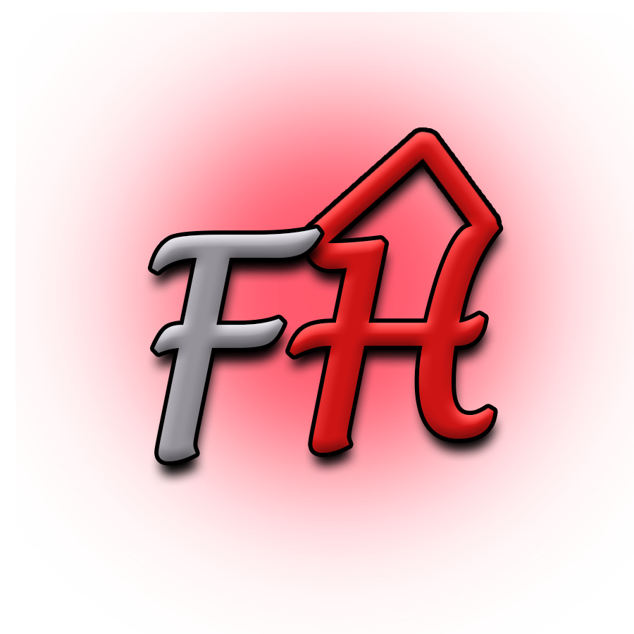

## Paso 3. Mi equipo UX-Case Study

 3.a ¿Como se cuenta un UX-Case Study?
-----
Tras analizar los métodos UX utilizados en la página de MuseMap, hay dos que destacan sobre el resto:

- Competitive Analysis: esta sección es realmente importante debido a que permitió al equipo de desarrollo de MuseMap comprobar las funcionalidades implementadas en las aplicaciones ya existentes, para conocer cuáles estaban menos representadas así como aquellas que, debido a su gran uso, los usuarios esperan en toda aplicación del estilo. Gracias a este conocimiento pudieron determinar qué funcionalidades implementar para desarrollar un producto único y relevante.

- Affinity Mapping: este método UX fue fundamental en el desarrollo de MuseMap porque, según mencionan en el documento, antes de llevarlo a cabo tenían una idea que se alejaba de aquella que realmente tenían la mayoría de los usuarios sobre una aplicación enfocada en el arte callejero. Se basa en, tras realizar entrevistas a usuarios con perfiles y afinidades dispares, seleccionados de una encuesta, se recogen todas sus ideas y opiniones haciendo énfasis en aquellas en las que la mayoría de usuarios coinciden. Estas ideas se contrastan con las que originalmente tenía el equipo de desarrollo con el objetivo de encontrar la mejor propuesta.

Un método UX que MuseMap no utilizó fue el Usability Review. Utilizarlo sobre uno de los competidores analizados en el Competitive Analysis podría ayudarles a encontrar problemas de usabilidad que pueden no apreciarse a simple vista. Esto podría ayudarles a no cometer dichos errores durante el desarrollo de su producto.

Otro método UX que tampoco se muestra en el Caste Study del desarrollo de MuseMap es el Labelling. Un correcto uso de este método les podría haber ayudado a determinar qué funcionalidad estaba implementando cada sección de su aplicación.

  3.b Logotipo
----

Hemos utilizado Photoshop Portable CS8 para realizar el logotipo, con la idea de hacerlo lo más simple pero reconocible a simple vista posible. Por este motivo hemos utilizado una paleta de colores muy reducida y añadido a la H un grafismo para hacerla similar a una casa.
Debido a que el logotipo tiene una forma que se adapta tanto a plataformas que requieran de fotos cuadradas como a otras que utilicen formas redondeadas, y que su fondo es transparente al aprovechar esta propiedad del formato de imágenes PNG, el logotipo podría utilizarse para representar a la aplicación en cualquier red social o portal web sobre el que se utilice. Para un banner (que suele tener forma rectangular) debería de complementarse el logo con otra imagen que rellene el espacio restante; gracias a la reducida paleta de colores utilizada, hacerlo no debería de suponer ningún problema.

 3.c Guidelines
----

>>> Tras documentarse, muestre las deciones tomadas sobre Patrones IU a usar para la fase siguiente de prototipado.

  3.d Video
----

>>> Documente y resuma el diseño de su producto en forma de video de 90 segundos aprox

  3.e Valoración grupal
----
