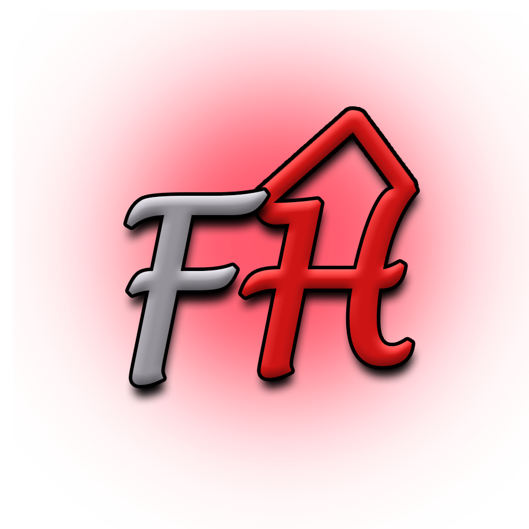
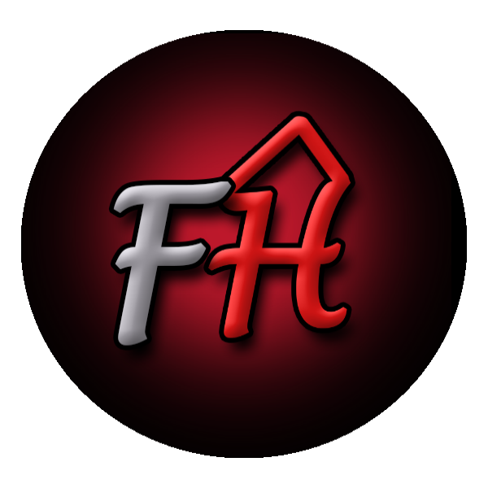
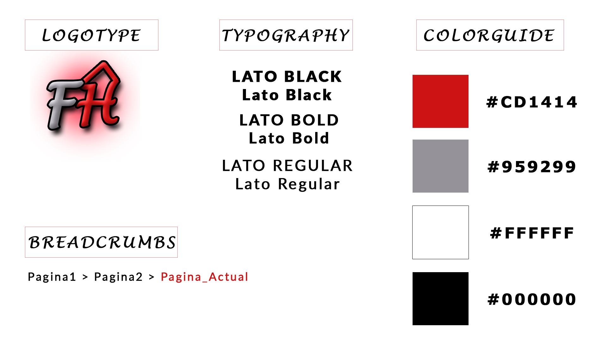

## Paso 3. Mi equipo UX-Case Study

 3.a ¿Como se cuenta un UX-Case Study?
-----
Tras analizar los métodos UX utilizados en la página de MuseMap, hay dos que destacan sobre el resto:

- Competitive Analysis: esta sección es realmente importante debido a que permitió al equipo de desarrollo de MuseMap comprobar las funcionalidades implementadas en las aplicaciones ya existentes, para conocer cuáles estaban menos representadas así como aquellas que, debido a su gran uso, los usuarios esperan en toda aplicación del estilo. Gracias a este conocimiento pudieron determinar qué funcionalidades implementar para desarrollar un producto único y relevante.

- Affinity Mapping: este método UX fue fundamental en el desarrollo de MuseMap porque, según mencionan en el documento, antes de llevarlo a cabo tenían una idea que se alejaba de aquella que realmente tenían la mayoría de los usuarios sobre una aplicación enfocada en el arte callejero. Se basa en, tras realizar entrevistas a usuarios con perfiles y afinidades dispares, seleccionados de una encuesta, se recogen todas sus ideas y opiniones haciendo énfasis en aquellas en las que la mayoría de usuarios coinciden. Estas ideas se contrastan con las que originalmente tenía el equipo de desarrollo con el objetivo de encontrar la mejor propuesta.

Un método UX que MuseMap no utilizó fue el Usability Review. Utilizarlo sobre uno de los competidores analizados en el Competitive Analysis podría ayudarles a encontrar problemas de usabilidad que pueden no apreciarse a simple vista. Esto podría ayudarles a no cometer dichos errores durante el desarrollo de su producto.

Otro método UX que tampoco se muestra en el Caste Study del desarrollo de MuseMap es el Labelling. Un correcto uso de este método les podría haber ayudado a determinar qué funcionalidad estaba implementando cada sección de su aplicación.

  3.b Logotipo
----

 

Hemos utilizado Photoshop Portable CS8 para realizar el logotipo, con la idea de hacerlo lo más simple pero reconocible a simple vista posible. Por este motivo hemos utilizado una paleta de colores muy reducida y añadido a la H un grafismo para hacerla similar a una casa.
Debido a que el logotipo tiene una forma que se adapta tanto a plataformas que requieran de fotos cuadradas como a otras que utilicen formas redondeadas, y que su fondo es transparente al aprovechar esta propiedad del formato de imágenes PNG, el logotipo podría utilizarse para representar a la aplicación en cualquier red social o portal web sobre el que se utilice. Para un banner (que suele tener forma rectangular) debería de complementarse el logo con otra imagen que rellene el espacio restante; gracias a la reducida paleta de colores utilizada, hacerlo no debería de suponer ningún problema.

Un ejemplo de un banner que se podría crear a partir del logotipo es el siguiente:

Banner original: 1920x1080px (el ancho se ajusta al tamaño de GitHub)

Banner recortado 1: 1920x840px (el ancho se ajusta al tamaño de GitHub)

Banner recortado 2: 1920x500px (el ancho se ajusta al tamaño de GitHub)

 3.c Guidelines
----

Tipografía: hemos elegido Lato, una tipografía diseñada por el artista polaco Łukasz Dziedzic y publicada bajo licencia open-source con el apoyo de Google. Creemos que es una tipografía moderna y sencilla, que facilita la lectura de párrafos de texto como son las descripciones de los pisos de nuestra aplicación.

Gama de colores: hemos optado por una gama de colores minimalista, donde el blanco y negro aportan claridad y elegancia, mientras que el rojo es el color representativo de la aplicación que puede ser utilizado para enfatizar ciertos elementos de la interfaz de usuario. Además, hemos utilizado un cuarto color, el gris, para trabajar con una gama de colores menos lineal.

Breadcrumbs: es común utilizar breadcrumbs en las páginas webs de hoy en día. En cambio, en móvil, debido al reducido espacio de visualización, no podemos optar por utilizar una navegación breadcrumb tradicional. Es por esto que hemos utilizado una navegación acortada que únicamente muestra la página actual, resaltada en rojo, y dos páginas anteriores. De esta forma podemos mostrarlo en dispositivos móviles sin perjudicar la experiencia del usuario, al evitar que ocupe gran parte de la interfaz de usuario o sea demasiado pequeño.

  3.d Video
----

El vídeo se encuentra disponible siguiendo el siguiente enlace: (https://www.youtube.com/watch?v=qQBUKe2nYXc)

  3.e Valoración grupal
----
